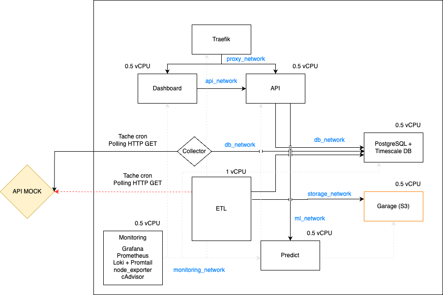

# Décision d'architecture V2 — pivot tout on-premise — 02/09/2026

| Champ | Valeur |
| --- | --- |
| Projet | EnerVision — Smart Energy Optimizer |
| Groupe | G5 |
| Statut | Actée |
| Date de décision | 02/09/2026 |
| Décideurs | Équipe G5 au complet |
| Déclencheur | Difficultés d'accès aux ressources Azure ; arbitrage coût / simplicité en faveur d'un environnement unique |
| Portée | Remplace partiellement le [relevé d'atelier du 31/08/2026](2026-08-31-releve-atelier-architecture.md) ; formalisée par [ADR-017](../ADR/ADR-017-pivot-tout-on-premise.md) |

## La décision en une phrase

Toute la plateforme (collecte, stockage, API, prédiction, monitoring) est
déployée sur la VM on-premise de l'école en conteneurs Docker Compose,
provisionnée et configurée par Ansible, avec Traefik comme point d'entrée
unique et Garage comme stockage objet compatible S3 en remplacement du
stockage cloud.

Le principe directeur de l'atelier, la frontière de résidence des données,
n'est pas abandonné : il est porté à son maximum. Plus aucune donnée, agrégée
ou non, et plus aucun artefact ne quitte le périmètre souverain. Ce qui change
est le moyen d'obtenir l'élasticité, désormais assumée comme une limite
documentée plutôt que déléguée à un cloud.

## Ce qui change par rapport à l'atelier

| Domaine | Décision d'atelier (31/08) | Décision V2 |
| --- | --- | --- |
| Infrastructure globale | Hybride : données on-premise, inférence et front sur Azure (ADR-001) | Tout on-premise sur la VM école |
| Hébergement du dashboard | Azure Static Web Apps (ADR-004) | Conteneur servi par Traefik |
| Localisation de l'inférence | Azure, Container Apps ou Functions (ADR-003) | Conteneur Predict sur la VM, appelé par l'API seule, jamais exposé |
| Stockage objet (artefacts, archives) | Blob Storage Azure | Garage, auto-hébergé, compatible S3 |
| Lien inter-environnements | Canal chiffré VPN ou passerelle (ADR-015) | Supprimé, sans objet |
| IaC principal | Terraform (Azure) + Ansible (VM) (ADR-011) | Ansible seul ; Terraform retiré du périmètre |
| Gestion des secrets | Azure Key Vault + fichiers env (ADR-013) | Vault Ansible chiffré et fichiers env hors Git, déployés par Ansible ; secrets CI dans GitHub Actions |
| Ingestion | ETL unique (polling + transformation) | Séparée : Collector (polling du Mock) et ETL (transformation, imputation) |
| Appel des prédictions | Dashboard appelle Predict en direct | Dashboard appelle l'API seule, qui interroge Predict sur `ml_network` |

Décisions confirmées sans changement : PostgreSQL + TimescaleDB (ADR-002),
FastAPI (ADR-007), React + Recharts (ADR-008), JWT via OAuth2 (ADR-009),
XGBoost + MLflow (ADR-010), GitHub Actions, Grype + OWASP ZAP (ADR-012 ;
SonarQube, confirmé ce jour-là, a été retiré depuis par ADR-016), structure en
submodules et contrats OpenAPI gelés (ADR-014), couverture de tests à 70 %,
réseaux Docker segmentés, désormais six : proxy, api, db, storage, ml,
monitoring.

## Justification par axe

- **Souveraineté et conformité.** L'axe gagnant du pivot. Aucune donnée ni
  artefact ne quitte le périmètre ; l'exposition au CLOUD Act devient nulle
  par construction, et non par précaution contractuelle. Argument renforcé
  face à un client industriel sensible à la localisation de ses données.
- **Coût.** Infrastructure à coût marginal nul, la VM étant fournie. Le poste
  cloud disparaît entièrement du budget.
- **Complexité opérationnelle.** Le vrai moteur de la décision : un seul
  environnement à opérer, sécuriser et monitorer au lieu de deux, plus de lien
  inter-environnements à protéger, plus de double outillage IaC. C'est ce qui
  rend le planning J4-J7 tenable.
- **Scalabilité.** La limite assumée. Le plafond est celui de la VM. Trois
  éléments la rendent défendable : la charge du pilote (7 sites, une mesure
  par minute) tient très largement dans ce plafond ; toute la plateforme est
  conteneurisée et décrite en infrastructure as code, donc portable ; migrer
  un composant vers un cloud redevient un changement de cible de déploiement,
  pas une refonte, et Predict, premier à saturer, est aussi le plus facile à
  déplacer, son contrat et son artefact étant isolés.

## Architecture cible

| Composant | Ressources | Rôle |
| --- | --- | --- |
| Traefik | 0,5 vCPU | Entrée unique :443, TLS, routage vers Dashboard et API |
| Dashboard | 0,5 vCPU | Front React servi en conteneur |
| API | 0,5 vCPU | API métier FastAPI, JWT, sert la base, interroge Predict et archive ses prédictions |
| Predict | 0,5 vCPU | Inférence, charge le modèle versionné depuis MLflow, jamais exposé directement |
| MLflow | 0,5 vCPU | Registre et tracking, backend store en base, artefacts dans Garage |
| Collector | 0,5 vCPU | Polling du Mock toutes les minutes, écrit les mesures brutes |
| ETL | 1 vCPU | Transformation et imputation (brut jamais écrasé), archives vers Garage |
| Entraînement | ponctuel | Job planifié, lit l'historique, enregistre runs et modèles dans MLflow |
| PostgreSQL + TimescaleDB | 0,5 vCPU | Base de référence : mesures, prédictions, backend MLflow |
| Garage | 0,5 vCPU | Stockage objet compatible S3 : artefacts de modèles, archives brutes |
| Monitoring | 0,5 vCPU | Prometheus, Grafana, Loki + Promtail, node_exporter, cAdvisor |

Total alloué : 6 vCPU hors job d'entraînement, à valider contre la capacité
réelle de la VM et à ajuster dans les limites Docker Compose.

## Impacts et actions de mise en cohérence

| # | Action | Responsable | Échéance | État au 06/09/2026 |
| --- | --- | --- | --- | --- |
| 1 | Contrat : le dashboard ne consomme plus que l'API métier, qui expose les prédictions | GL + LM | avant la page prédictions | Fait, sous une autre forme que prévue : l'API archive les prédictions par un job et les sert en `GET /api/v1/sites/{site_id}/predictions` (contrat api 1.1.0), le dashboard ne génère plus de types depuis `openapi-predict.json` |
| 2 | Backlog : EV-23 devient déploiement de Predict sur la VM ; EV-26 (Terraform Azure) fermée avec motif ; EV-28 (lien inter-env) fermée sans objet ; EV-37 Ansible passe en Must | LP | prochain daily | Fait : `infra#1`, `#2`, `#4` fermées avec renvoi vers ADR-017 |
| 3 | Section 10 des cinq dossiers EC01 : consigner le pivot avec date et justification | chacun | sous 48 h | Hors dépôt |
| 4 | Guide OpenAPI équipe : section dashboard, un seul fichier de types | PL | avec l'action 1 | Hors dépôt |
| 5 | Ansible : le playbook complet devient le socle IaC, gestion des secrets sans Key Vault documentée | CM | J4 | Fait : rôles Ansible et `vault.yml` chiffré, README d'`infra` |
| 6 | Monitoring : les six réseaux sont scrapés, alerte sur le retard d'ingestion du Collector | CM | J5 | En cours, voir `infra#42` |

## Objection anticipée

« Le sujet demande une plateforme cloud-native et vous n'avez plus de cloud. »
Cloud-native décrit une manière de construire, pas un lieu d'hébergement. La
plateforme en coche les attributs : conteneurisée de bout en bout, services
découplés communiquant par contrats d'API versionnés, infrastructure décrite
en code et reproductible, déploiement automatisé par pipeline, observabilité
native. Migrer un composant vers un cloud public redeviendrait un changement
de cible Ansible et de variables, pas une réécriture. Le choix on-premise est
un choix de résidence des données, argumenté sur les cinq axes exigés et
documenté avec ses limites.
